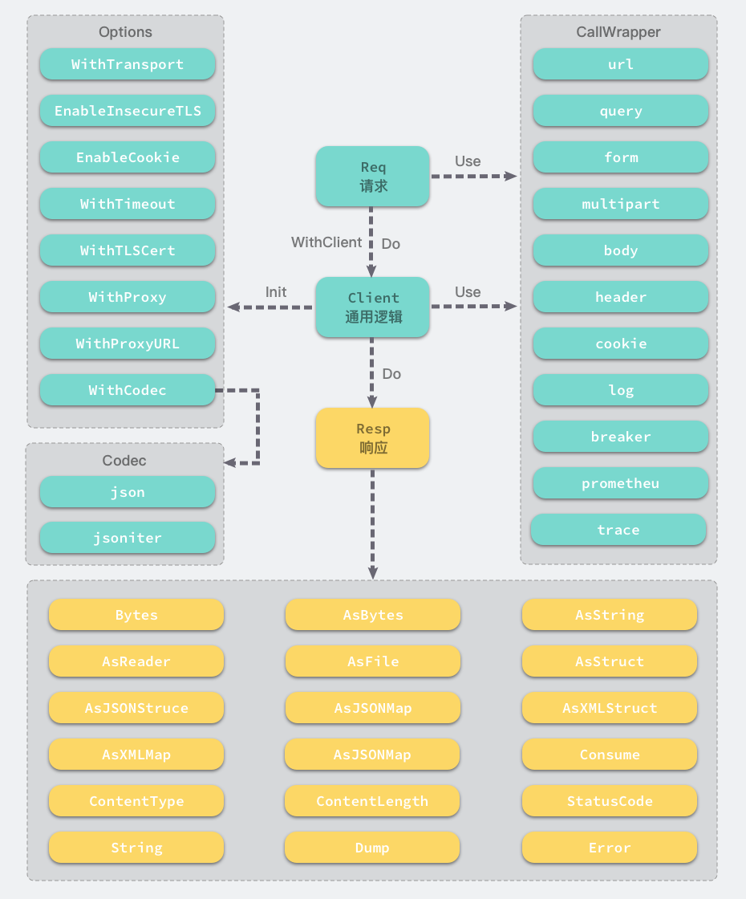

类似java的OKHttp的简单易用的HTTP客户端。

## 设计



三个核心概念：

- Client

  提供可复用的通用逻辑封装，主要是两个方面：

  - httpclient的配置，如cookie，tls，超时，代理，body的编解码方式等
  - 通用逻辑封装，插件机制实现在请求前后对request和response做二次处理，比如认证，熔断，打印调用日志，设置api基础路径等，支持自定义插件开发。

- Req

  request的封装，更方便的设置，使用与Client相同的插件，只是作用域不同。

- Resp

  response的封装，提供各种方便的获取响应内容的方法。


## 应用场景

可以简单高效的解决如下常用使用场景：

- 简单的调用一个接口地址并获取返回值
- 调用api接口时需要补充认证相关的参数
- 上传/下载文件
- 调用api接口时，需要判断接口是否返回错误，并解析返回数据到struct
- 调用api接口时，只是想获取返回内容的某一个字段的值，并不想构建struct
- 调用时自动打印请求和响应内容
- 熔断
- opentracing
- prometheus

## 安装

```shell
go get -u github.com/aiscrm/goreq
```


## 例子

### 简单例子

```go
goreq.Get(ts.URL).Use(log.Dump()).Do().AsString()
```

## TODO

- [ ] prometheus

